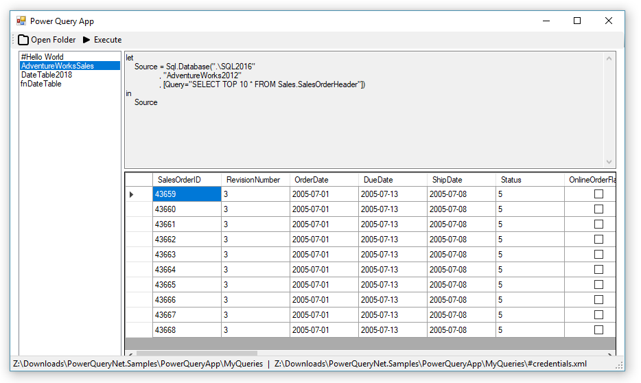

# PowerQueryNet
Run Power Query M formula language from anywhere.

## About
PowerQueryNet allows you to run M formulas commonly used in Power BI and Excel (aka Get & Transform) from the Command Prompt or any .NET application.

## Download

Installer: [PowerQueryNet.msi](https://github.com/gsimardnet/PowerQueryNet/releases/latest/download/PowerQueryNet.msi)

Dependency: [PowerQuerySdk.vsix 1.0.0.16](http://dakahn.gallery.vsassets.io/_apis/public/gallery/publisher/dakahn/extension/powerquerysdk/1.0.0.16/assetbyname/PowerQuerySdk.vsix) 

(Upon installation `PowerQuerySdk.vsix` must be in the same folder as `PowerQueryNet.msi`)

Samples: [PowerQueryNet.Samples.zip](https://github.com/gsimardnet/PowerQueryNet/releases/download/v1.0.3/PowerQueryNet.Samples.zip)

## PQNet 

PQNet is a Command Line Interface (CLI) that comes with the installation of PowerQueryNet.

### Features

Export the result of a query to several formats (CSV, JSON, HTML, XML)
```txt
pqnet "#Hello World.pq" -o json
```

Export the result of a query to a SQL Server database
```txt
pqnet "#Hello World.pq" -s "Data Source=.\SQL2016;Initial Catalog=AdventureWorks2012;Integrated Security=SSPI" -t "dbo.HelloWorld"
```

Output the result of a Power BI query to file
```txt
pqnet MyReport.pbix Query1 -o csv -f result.csv
```

## Hello, World! - PQNet (CLI)

1. Create a new file with the following content:
```txt
let Source = "Hello, World!" in Source
```
2. Save the file as helloworld.pq
3. Run the following in the Command Prompt:
```txt
pqnet helloworld.pq
```

## Hello, World! - .NET (C#)

1. From your .NET project, add a reference to `PowerQueryNet.Client`
2. Run the following:
```txt
var qry = new Query { Formula = "let hw = \"Hello World\" in hw" };
var pqc = new PowerQueryCommand() { ExecuteOutputFlags = ExecuteOutputFlags.Csv };
var result = pqc.Execute(qry);
```
## Power Query App
Run queries in a standalone application


## Build requirements

* Visual Studio 2015+

To build the Setup project, [WiX Toolset](http://wixtoolset.org/releases/) must be installed.

## Copyright

Copyright 2019

Licensed under the [MIT License](LICENSE)
